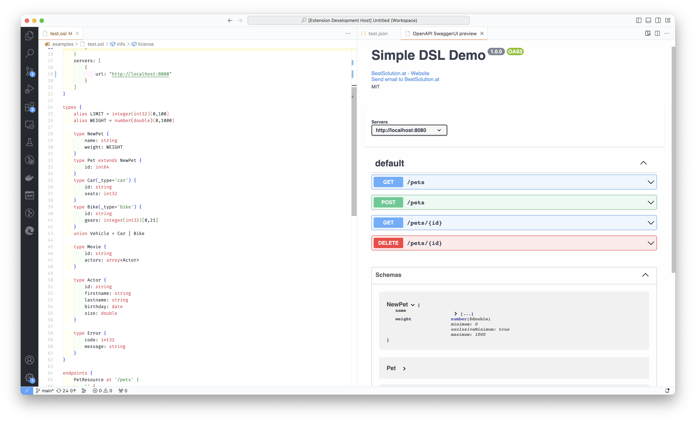

# openapi-dsl

This repository contains a proof-of-concept DSL to describe OpenAPI-Documents in a concise and human readable way.



# How to try

See [langium-quickstart.md](langium-quickstart.md) for a detail description

## Local generator

```sh
npm install
npm run build
node ./bin/cli generate examples/test.osl
code generated/test.osl
```

## In the browser

As Languim works perfectly fine inside a modern browser you can use the DSL in your favorite browser right away
by going https://bestsolution-at.github.io/openapi-dsl . Give it a try and let us know what features you are missing.
